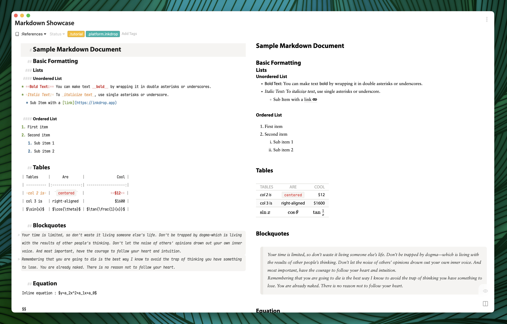
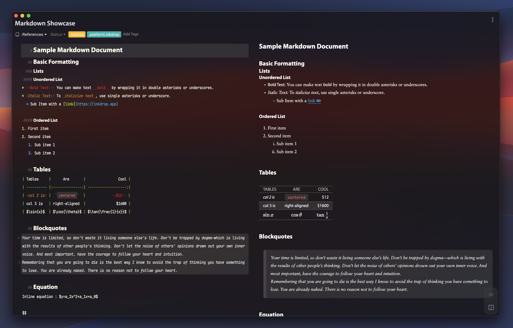
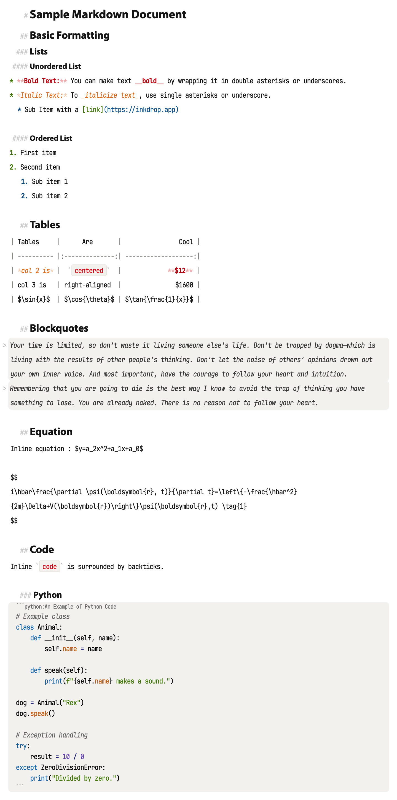
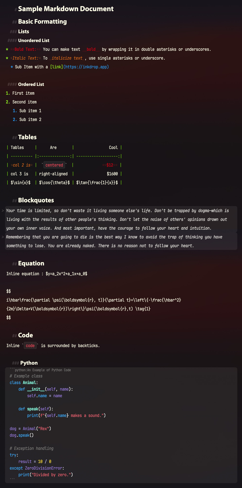

# Modern Type Syntax Theme for Inkdrop
Where Clarity Meets Elegance in Markdown Editing


# Introduction

The Modern Type Theme prioritizes clarity and ease of reading, making it perfect for both long hours of writing and quick note-taking.

## Screenshots


**Light Theme**


**Dark Theme**

## Details

|||
|---|---|
|Light Theme|Dark Theme|


# Notes

This syntax theme uses Sans-serif fonts for the headings on Google Fonts by default. If you are dissatisfied with this behavior, it is overwritten by the `styles.less` file using the CSS Variables:

```
:root {
  --inkdrop-header-font: monospace;
}
```
